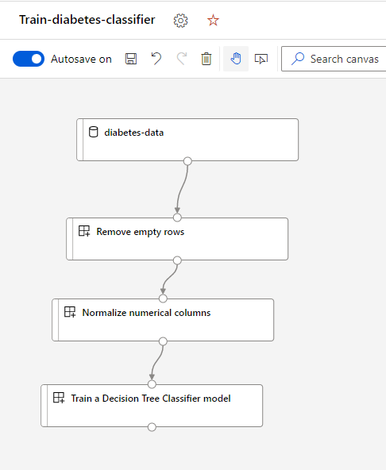

---
lab:
    title: 'Lab: Run a pipeline with components'
    module: 'Module: Run component-based pipelines in Azure Machine Learning with CLI (v2)'
---

# Run a pipeline with components

In this exercise, you will build a pipeline with components. The pipeline will be submitted with the CLI (v2). First, you'll run a pipeline. Next, you'll create components in the Azure Machine Learning workspace so that they can be reused. Finally, you'll create a pipeline with the Designer in the Azure Machine Learning Studio to experience how you can reuse components to create new pipelines.

## Prerequisites

Before you continue, complete the [Create an Azure Machine Learning Workspace and assets with the CLI (v2)](01-create-workspace.md) lab to set up your Azure Machine Learning environment.

You'll run all commands in this lab from the Azure Cloud Shell.

1. Open the Cloud Shell by navigating to [http://shell.azure.com](https://shell.azure.com/?azure-portal=true) and signing in with your Microsoft account.
1. The repo [https://github.com/MicrosoftLearning/mslearn-aml-cli](https://github.com/MicrosoftLearning/mslearn-aml-cli) should be cloned. You can explore the repo and its contents by using the `code .` command in the Cloud Shell.
1. If your compute instance is stopped. Start the instance again by using the following command. Change <your-compute-instance-name> to your compute instance name before running the code:
    ```azurecli
    az ml compute start --name "<your-compute-instance-name>"
    ```

## Run a pipeline

You can train a model by running a job that refers to one training script. To train a model as part of a pipeline, you can use Azure Machine Learning to run multiple scripts. The configuration of the pipeline is defined in a YAML file.

In this exercise, you'll start by preprocessing the data and training a Decision Tree model. To explore the pipeline job definition **job.yml** navigate to **mslearn-aml-cli/Allfiles/Labs/05/job.yml**. The dataset used is the **diabetes-data** dataset registered to the Azure Machine Learning workspace in the set-up.

1. Run the following command in the Cloud Shell to open the files of the cloned repo.

    ```azurecli
    code .
    ```

2. Navigate to **mslearn-aml-cli/Allfiles/Labs/05/** and open **job.yml** by selecting the file.
3. Change the **compute** value: replace `<your-compute-instance-name>` with the name of your compute instance.
4. Run the job by using the following command:

    ```azurecli
    az ml job create --file ./mslearn-aml-cli/Allfiles/Labs/05/job.yml
    ```

5. Open another tab in your browser and open the Azure Machine Learning Studio. Go to the **Experiments** page and locate the **diabetes-pipeline-example** experiment. Open the run to monitor the job. Refresh the view if necessary. Once completed, you can explore the details of the job and of each component by expanding the **Child runs**.

## Create components

To reuse the pipeline's components, you can create the component in the Azure Machine Learning workspace. In addition to the components that were part of the pipeline you've just ran, you'll create another new component you haven't used before. You'll use the new component in the next part.

1. Each component is created separately. Run the following code to create the components:

    ```azurecli
    az ml component create --file ./mslearn-aml-cli/Allfiles/Labs/05/summary-stats.yml
    az ml component create --file ./mslearn-aml-cli/Allfiles/Labs/05/fix-missing-data.yml
    az ml component create --file ./mslearn-aml-cli/Allfiles/Labs/05/normalize-data.yml
    az ml component create --file ./mslearn-aml-cli/Allfiles/Labs/05/train-decision-tree.yml
    az ml component create --file ./mslearn-aml-cli/Allfiles/Labs/05/train-logistic-regression.yml
    ```

2. Navigate to the **Components** page in the Azure Machine Learning Studio. All created components should show in the list here. 

## Create a new pipeline with the Designer

You can reuse the components by creating a pipeline with the Designer. You can recreate the same pipeline, or change the algorithm you use to train a model by replacing the component used to train the model.

1. Navigate to the **Designer** page in the Azure Machine Learning Studio.
2. Select the **Custom** tab at the top of the page.
3. Create a new empty pipeline using custom components.
4. Rename the pipeline to *Train-Diabetes-Classifier*.
5. In the left menu, select the **Data** tab.
6. Drag and drop the **diabetes-data** component to the canvas.
7. In the left menu, select the **Component** tab.
8. Drag and drop the **Remove Empty Rows** component on to the canvas, below the **diabetes-data**. Connect the output of the data to the input of the new component.
9. Drag and drop the **Normalize numerical columns** component on to the canvas, below the **Remove empty rows**. Connect the output of the previous component to the input of the new component.
10. Drag and drop the **Train a Decision Tree Classifier Model** component on to the canvas, below the **Normalize numerical columns**. Connect the output of the previous component to the input of the new component. Your pipeline should look like this:


11. Select **Configure & Submit** to setup the pipeline job.
12. On the **Basics** page create a new experiment, name it *diabetes-designer-pipeline* and select **Next**.
13. On the **Inputs & outputs** page select **Next**.
14. On the **Runtime settings** page set the default compute target to use the compute instance you created and select **Next**.
15. On the **Review + Submit** page select **Submit** and wait for the job to complete.

## Update the pipeline with the Designer

You have now trained the model with a similar pipeline as before (only omitting the calculation of the summary statistics). You can change the algorithm you use to train the model by replacing the last component:

1. Remove the **Train a Decision Tree Classifier Model** component from the pipeline. 
2. Drag and drop the **Train a Logistic Regression Classifier Model** component on to the canvas, below the **Remove empty rows**. Connect the output of the previous component to the input of the new component.

    The new model training component expects a numeric input, namely the regularization rate.

3. Select the **Train a Logistic Regression Model** component and enter **1** for the **regularization_rate**. Your pipeline should look like this:

4. Submit the pipeline. Select the existing experiment named *diabetes-designer-pipeline*. Once completed, you can review the metrics and compare it with the previous pipeline to see if the model's performance has improved.

## Clean up resources

When you're finished exploring Azure Machine Learning, shut down the compute instance to avoid unnecessary charges in your Azure subscription.

You can stop a compute instance with the following command. Change `"testdev-vm"` to the name of your compute instance if necessary.

```azurecli
az ml compute stop --name "testdev-vm" --no-wait
```

> **Note:** Stopping your compute ensures your subscription won't be charged for compute resources. You will however be charged a small amount for data storage as long as the Azure Machine Learning workspace exists in your subscription. If you have finished exploring Azure Machine Learning, you can delete the Azure Machine Learning workspace and associated resources. However, if you plan to complete any other labs in this series, you will need to repeat the set-up to create the workspace and prepare the environment first.

To completely delete the Azure Machine Learning workspace, you can use the following command in the CLI:

```azurecli
az ml workspace delete
```
